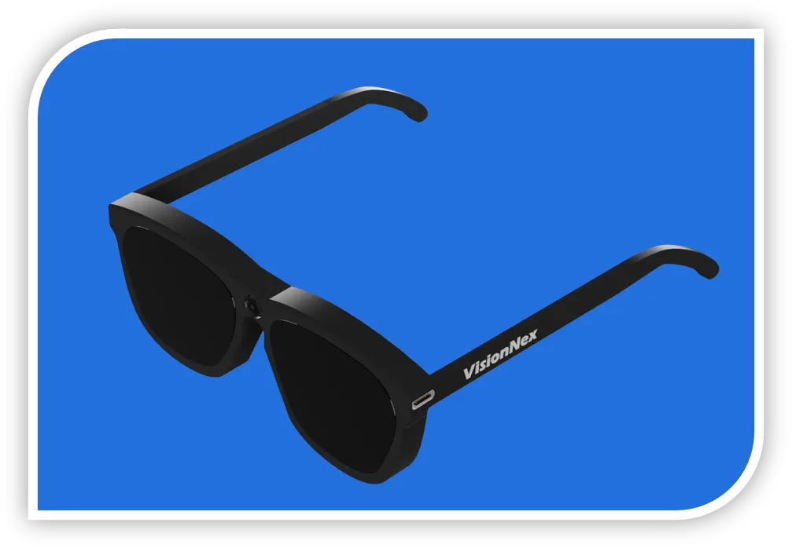
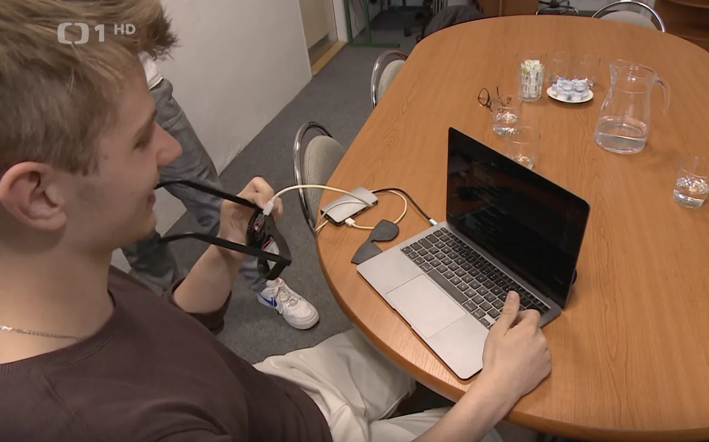
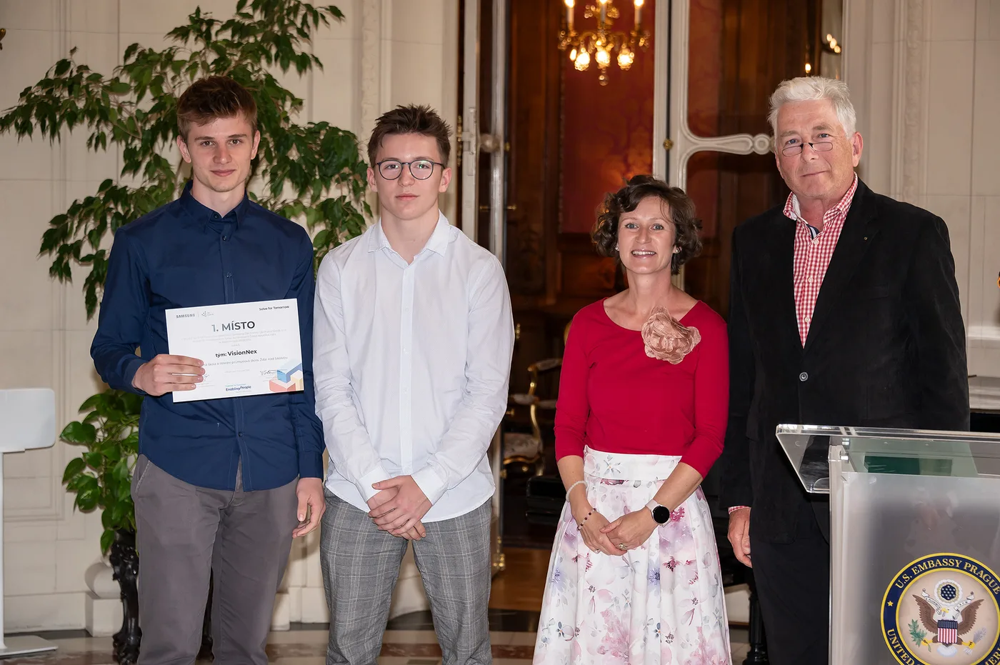
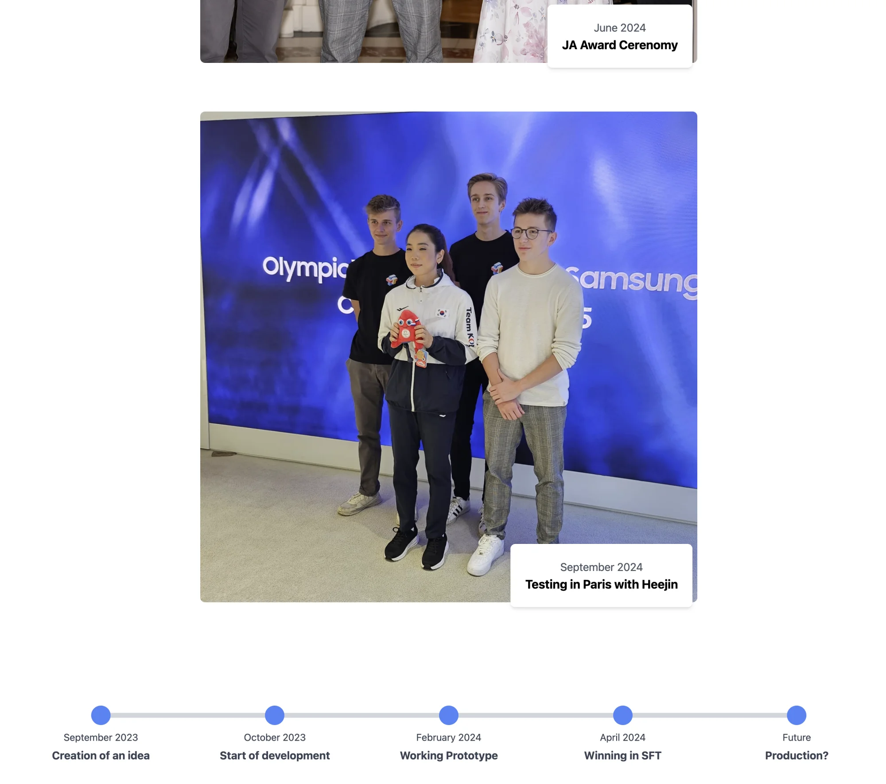

<p align="center">
  
</p>

<h1 align="center">VisionNex</h1>
<p align="center"><strong>The interactive site for our smart-glasses project</strong></p>

<p align="center">
  <a href="https://visionnex.cz">visionnex.cz</a>
</p>


<table>
  <tr>
    <td width="50%"><p align="center"><sub>The physical prototype as featured on Czech national TV (ČT24)</sub></p></td>
    <td width="50%"><p align="center"><sub>On stage at JA Ceremony</sub></p></td>
  </tr>
</table>

<br>

## What it is

VisionNex is a hardware project developing smart glasses designed to help visually impaired individuals better orient themselves in their surroundings.

With this website we want people to better understands what the problem is, how the hardware works, and what it looks
like assembled, the journey building it and our milestones.


<div align="center">

</div>

<br>

## Features

- **Moving 3D model** of the glasses (`.obj`, rendered with Three.js) you can
  rotate and scroll around
- **Storytelling photo album** — the build, the team, and the press coverage
- **Progress timeline** of how the project actually went, not just the highlight reel
- **Custom carousel** for the gallery sections
- **Fully responsive**, built for both a phone in someone's hand and a projector on stage

## Tech stack

- **React 18** + Vite
- **Three.js** + **@react-three/fiber** / **drei** — the 3D glasses model
- **GSAP** (`@gsap/react`) — scroll-driven animation
- **Tailwind CSS**
- **React Router**

The glasses themselves (not in this repo) run on an embedded microcontroller
with C++, talk to a companion **Flutter** app, and use the OpenAI API for the
assistant logic.

## Running it locally

```bash
git clone https://github.com/xxKuzi/VisionNex.git
cd VisionNex
npm install
npm run dev
```

Open the printed local URL (Vite default is [localhost:5173](http://localhost:5173)).
No environment variables needed — everything here is static content and the
3D model asset in `public/`.

## License


This repository is shared for portfolio and viewing purposes only. You may clone and run the project locally solely to evaluate it. However, no permission is granted to use the code in other projects, modify it, or distribute it. See [LICENSE](./LICENSE).
