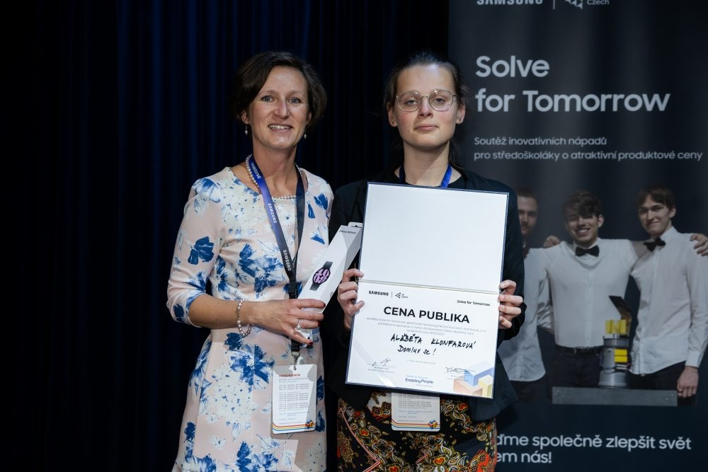

<p align="center">
  
</p>

<h1 align="center">VisionNex</h1>
<p align="center"><strong>The interactive site for our smart-glasses project — a 3D model, a storytelling scroll, and the whole build.</strong></p>

<p align="center">
  <a href="https://visionnex.cz">visionnex.cz</a>
</p>

> This repo is the **website**, not the glasses firmware. It's the
> presentation layer for a real hardware project — a scrollable pitch with a
> 3D model of the glasses you can rotate, built to show judges and visitors
> what VisionNex actually does.

<table>
  <tr>
    <td width="50%"><p align="center"><sub>The physical prototype, live on Czech national TV (ČT24)</sub></p></td>
    <td width="50%"><p align="center"><sub>On stage at Samsung's Solve for Tomorrow</sub></p></td>
  </tr>
</table>

## What it is

VisionNex started as a hardware project — glasses that read out what's in
front of you — and this site is how we told that story to a competition
audience: what the problem is, how the hardware works, and what it looks
like assembled, without making anyone read a slide deck. It won recognition
at Samsung's European Solve for Tomorrow.

## Features

- **Moving 3D model** of the glasses (`.obj`, rendered with Three.js) you can
  rotate and scroll around
- **Storytelling photo album** — the build, the team, and the press coverage
- **Progress timeline** of how the project actually went, not just the highlight reel
- **Custom carousel** for the gallery sections
- Fully responsive, built for both a phone in someone's hand and a projector on stage

## Tech stack

- **React 18** + Vite
- **Three.js** + **@react-three/fiber** / **drei** — the 3D glasses model
- **GSAP** (`@gsap/react`) — scroll-driven animation
- **Tailwind CSS**
- **React Router**

The glasses themselves (not in this repo) run on an embedded microcontroller
with C++, talk to a companion **Flutter** app, and use the OpenAI API for the
assistant logic.

## Running it locally

```bash
git clone https://github.com/xxKuzi/VisionNex.git
cd VisionNex
npm install
npm run dev
```

Open the printed local URL (Vite default is [localhost:5173](http://localhost:5173)).
No environment variables needed — everything here is static content and the
3D model asset in `public/`.

## License

No LICENSE file is committed to this repo. Shared for portfolio and viewing
purposes — add one if you want the terms explicit.
